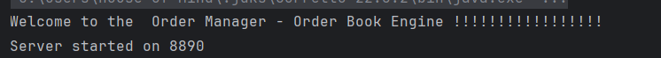
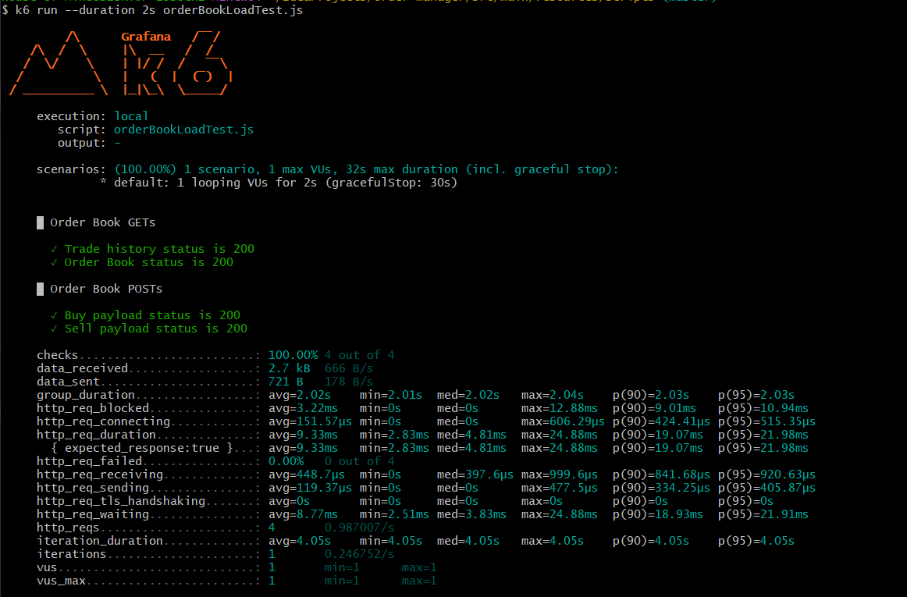
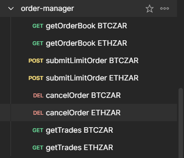

# Order Manager
An in memory order management application simulating limit order type.
The application create several endpoints to interact with via http.

### API Documentation :

#### Parameters:
{pairwise}: Enum- required - Currency pair wise. Supported values ("BTCZAR", "ETHZAR", "ETHBTC")
{limit}: Integer - optional - Number of records to return

#### Endpoints:
/v1/{pairwise}/orderbook- GET 

/v1/{pairwise}/tradehistory/{limit} -GET

/v1/{pairwise}/orderbook/limit - POST
body(required) :
{
    "side": "BUY", //Enum (SELL,BUY) - required
    "price": "5000", // Positive decimal - required
    "quantity": "234", // Positive decimal - required
    "timeInForce": "GTC" // Enum (GTC, FOK, IOC) - optional
}

/v1/{pairwise}/orderbook/cancel - Delete
body(required) :
{
"orderId": "d99f1e1a-441b-4fd0-9f9e-3b68886eb894s" //36 characters alphanumeric UUID - required
}

the postman collection for use

# Running Project
The project was created using IntelliJ Community edition, simple import the project and run the Main.kt file.
The project will run server on port 8890 from the Main.kt.

# Running unit Tests
The project unit tests are located at src/test/kotlin path, simple head to the path and execute each test suit.

# Running Load test
The project make use of k6 script to run load testing, located at src/main/resources/scripts/orderBookLoadTest.js.
To run the script, install(https://grafana.com/docs/k6/latest/set-up/install-k6/
) k6 and run the below command :

k6 run --duration 5s orderBookLoadTest.js

# External interaction
The project postman collection is located in src/main/resources/order-manager.postman_collection.json.
Simple run the project then the post man collection

